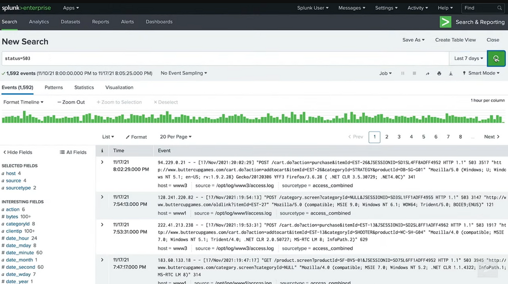
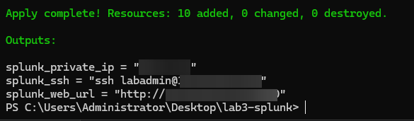
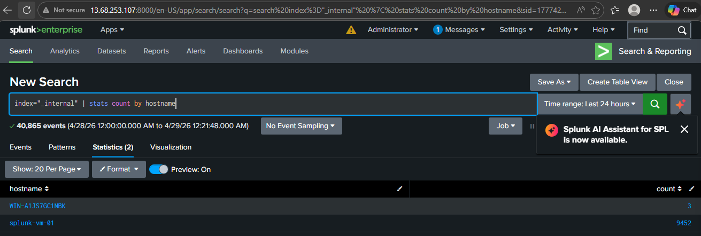
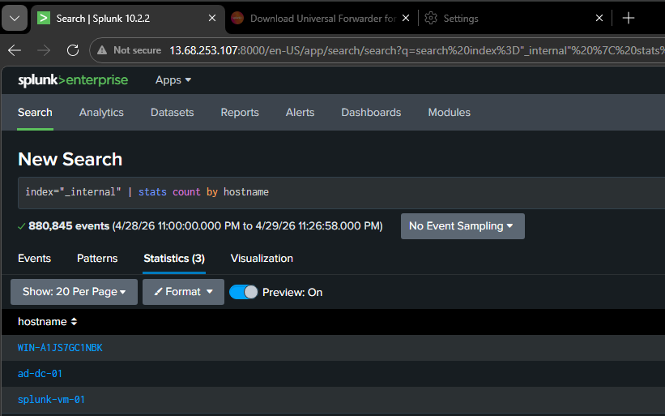
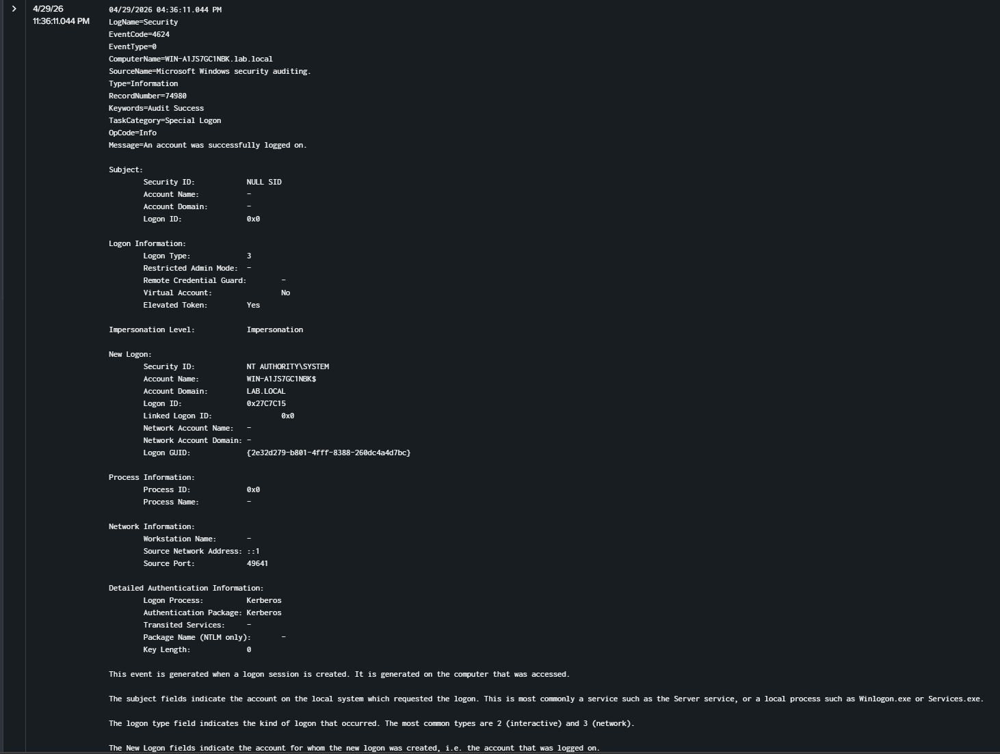

# Multi-Site Cloud SIEM Deployment: Splunk Enterprise via Terraform

**Part 2 of 2: Cloud Automation with Infrastructure as Code**

*This project covers the automated cloud deployment of a Linux-based Splunk SIEM environment. To see the foundational, manual configuration that preceded this automation, check out* [Splunk SIEM & Log Analysis (Part 1)](https://github.com/Dane139/splunk-home-lab)

## Implementation Overview
This project demonstrates the automated deployment of a Splunk SIEM in Azure to monitor a complex hybrid-cloud environment. I transitioned from manual configuration to Infrastructure as Code (IaC) to bridge the telemetry gap between an on-premises home lab (VirtualBox) and cloud-native Azure infrastructure.

### The Stack
* **Cloud Provider:** Microsoft Azure
* **IaC Tool:** Terraform
* **SIEM:** Splunk Enterprise (Indexer/Search Head)
* **Log Agents:** Splunk Universal Forwarder (UF)
* **OS:** Ubuntu 22.04 (SIEM), Windows Server 2025 (Endpoints)



---


## Technical Architecture

### 1. The Multi-Site Pipeline
* **Hybrid Link:** Configured secure ingestion (Port 9997) from an on-premises Windows Server across the public internet. Access was hardened via Terraform NSG rules to allow-list only my specific home public IP.
* **Private Bridge:** Utilized Azure VNet Peering to establish a private ingestion path for cloud-native VMs, keeping sensitive telemetry off the public internet and reducing data egress costs.

### 2. Infrastructure as Code (IaC) Logic
* **Network Security Groups:** Refactored HCL to support a "Dual-Path" ingestion model, whitelisting both Public and Internal VNet subnets.
* **Automation:** Managed the entire compute and networking lifecycle through Terraform, ensuring that the environment is repeatable and idempotent.






*Verifying hybrid ingestion from the on-premises lab alongside the IaC security rule enforcing least-privilege access via Public IP allow-listing.*

---

## 3. Pure Cloud Pipeline via VNet Peering

After securing the hybrid link, I established a cloud-native ingestion pipeline for an existing Azure Windows Server. Instead of routing traffic over the public internet, I utilized **Azure VNet Peering**.

**Challenge - The "Locked Door" Oversight:** By restricting the NSG to only my home public IP in Phase 2, I accidentally blocked internal Azure traffic. I resolved this by updating the IaC to include a secondary security rule granting Port 9997 access specifically to the internal `10.0.0.0/8` subnet, seamlessly enabling the private cloud bridge.



*Splunk Search Head confirming successful telemetry ingestion from the SIEM itself, the on-premises lab, and the cloud-native Active Directory endpoint over the private VNet bridge.*

---

## 4. Validating Security Telemetry (Threat Hunting)

With the infrastructure pipelines established, I manually configured the Universal Forwarder `inputs.conf` files via the CLI to capture Windows Security Events. To validate the pipeline, I simulated authentication events and monitored standard network logons.



*Successfully verified the ingestion and parsing of Windows Security Event Logs. The expanded view above demonstrates a Logon Type 3 (Network Logon) initiated by the local machine account, confirming that both user-interactive and background system authentications are being actively monitored.*

---

## Agent Configuration Snippets

While the infrastructure is managed via Terraform, the endpoint agents were configured using the following logic:

<details>
<summary>View outputs.conf (Routing Data)</summary>

```ini
[tcpout]
defaultGroup = default-autolb-group

[tcpout:default-autolb-group]
# On-Premises utilizes the SIEM's Public IP. 
# Cloud-Native endpoints utilize the SIEM's Private IP via VNet Peering (10.2.1.4:9997)
server = <DESTINATION_IP>:9997
```

</details>

<details>
<summary>View inputs.conf (Collecting Security Logs)</summary>

```ini
[WinEventLog://Security]
disabled = 0
```

</details>

*(Note: Troubleshooting agent failures required diagnosing hidden file extension configurations created by headless CLI text editors).*

---

## Enterprise Scaling Roadmap
1. **Splunk Deployment Server:** Transition from manual CLI configuration of forwarders to a centralized Deployment Server for mass-scale management.
2. **Managed Identities:** Use Azure Managed Identity for Terraform state storage and Indexer authentication, eliminating the need for local credentials.
3. **SOAR Integration:** Implement **Azure Logic Apps** to automate incident response (e.g., auto-blocking an IP in the NSG upon Splunk brute-force detection).

---

## Appendix: Real-World Challenges & Resolutions

Building a custom hybrid-cloud architecture rarely works perfectly on the first `terraform apply`. Here are the primary technical hurdles I encountered and resolved:

**1. The "Locked Door" Firewall Over-Correction**
- **The Issue:** When attempting to secure the data ingestion port (9997), I updated the Terraform NSG rule to only allow traffic from my home router's Public IP. This successfully secured the Hybrid pipeline but inadvertently blocked my Azure-native Windows VM from sending data across the internal VNet.
- **The Fix:** I refactored the Terraform code to include a secondary, parallel security rule explicitly granting Port 9997 access to the internal `10.0.0.0/8` subnet, harmonizing both the public and private ingestion paths.

**2. Headless Configuration Syntax Errors**
- **The Issue:** Despite the network pathways being open, Windows Security logs were failing to reach the SIEM.
- **The Fix:** I identified a classic Windows administrative trap: hidden file extensions. The configuration file was inadvertently saved as `inputs.conf.txt`. Removing the extension and forcing a restart of the `SplunkForwarder` service via PowerShell established the data flow.

**3. Simulating Threat Intelligence (NLA Filtering)**
- **The Issue:** While attempting to generate failed logon telemetry (Event ID 4625) via RDP brute-forcing, the logs were not appearing in Splunk.
- **The Fix:** I discovered that Network Level Authentication (NLA) drops bad RDP requests before the local security log processes them. I pivoted my threat hunt to successfully capture Type 3 (Network) and Type 10 (Interactive) Administrator logons via Event ID 4624, proving the SIEM's operational readiness.

**[View the Terraform Blueprints](./main.tf)**